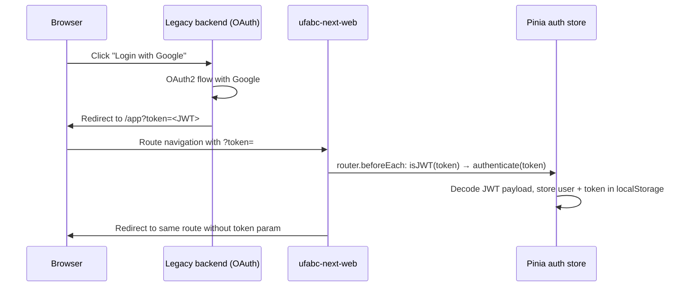
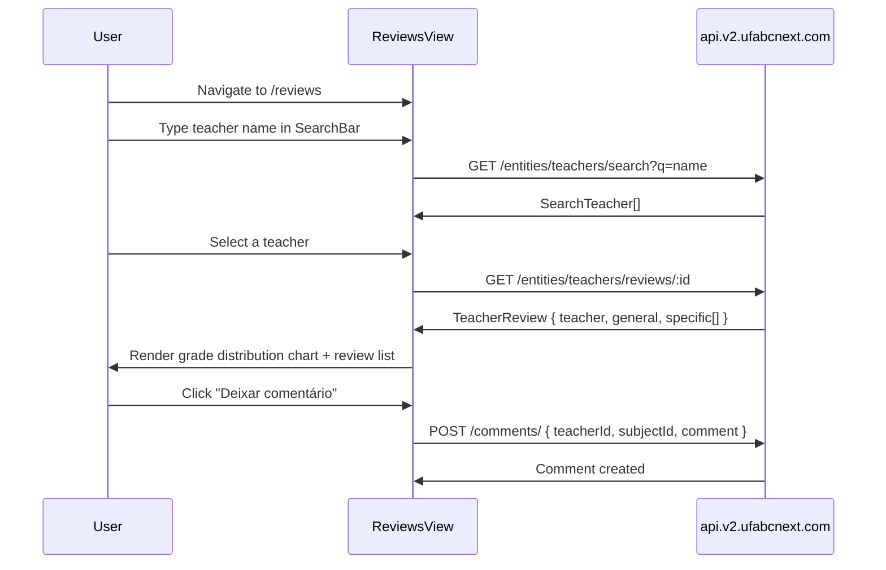
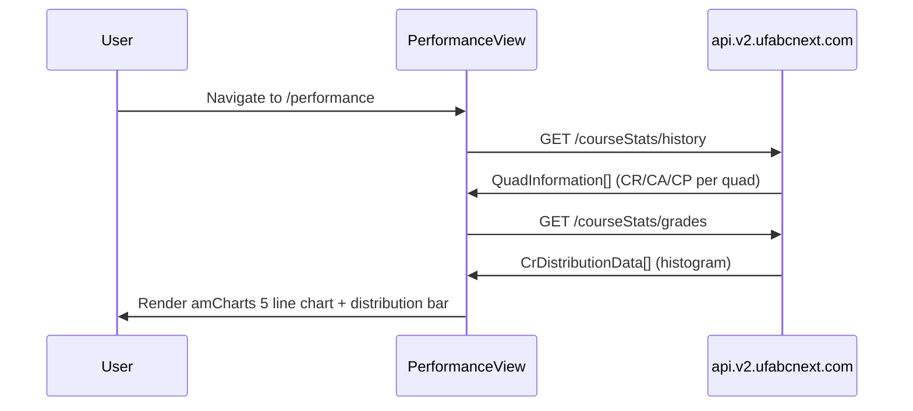
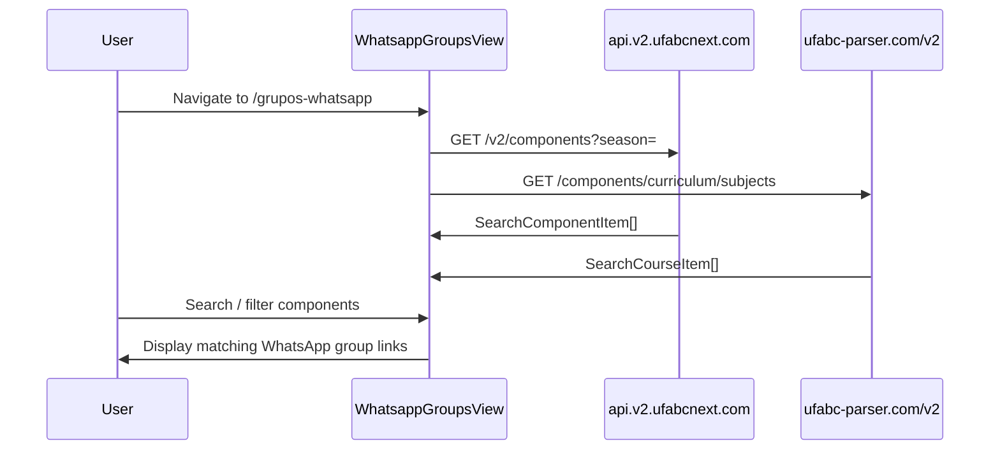

# ufabc-next-web — Documentation

## 1. System Overview

### What this repo does and why it exists

`ufabc-next-web` is the primary web frontend for the UFABC Next platform. It is a Vue 3 SPA (Single-Page Application) that allows UFABC students to browse teacher and subject reviews, visualize their academic performance (CR/CA/CP over time), view their full grade history, explore enrollment statistics, plan WhatsApp group membership, access the Calengrade calendar, and manage their account.

**Who uses it:**
- UFABC students — directly via browser at the production URL
- The extension (`ufabc-next-extension`) redirects users here for certain flows (e.g., to update history)

**Where it fits:**
The web frontend is a pure consumer of `ufabc-next-backend` (via `https://api.v2.ufabcnext.com`) and `ufabc-parser.com`. It holds no server-side logic. Authentication tokens originate from the legacy backend OAuth2 flow and are received as URL query parameters on redirect.

### Tech stack

| Layer | Technology | Version |
|---|---|---|
| Language | TypeScript + Vue 3 SFC | Vue ^3.5, TS ^5 |
| UI framework | Vuetify | ^3.11 |
| Build tool | Vite | latest |
| Monorepo | pnpm + Turborepo | pnpm ^9 |
| Node.js | 20.19 (CI pinned) | — |
| Server state | @tanstack/vue-query | ^5 |
| Client state | Pinia | latest |
| Form validation | vee-validate + Zod | — |
| Charts | amCharts 5 | — |
| Analytics | Mixpanel | — |
| HTTP client | axios | — |
| Testing | Vitest + jsdom + @testing-library/vue | — |
| API mocking | MSW | — |
| Lint/format | ESLint (custom config) | — |

---

## 2. Architecture

### Folder structure

```
apps/
├── container/                   # Main Vue 3 SPA
│   ├── src/
│   │   ├── App.vue              # Root component: AppBar, router-view, auth init, Mixpanel setup
│   │   ├── main.ts              # Vue app mount
│   │   ├── bootstrap.ts         # App bootstrap (Vuetify, query client, plugins)
│   │   ├── router/
│   │   │   └── index.ts         # All routes + navigation guards
│   │   ├── stores/
│   │   │   └── auth.ts          # Pinia auth store (persisted to localStorage)
│   │   ├── views/               # One folder per route
│   │   │   ├── Reviews/         # /reviews — teacher + subject search and reviews
│   │   │   ├── Performance/     # /performance — CR/CA/CP charts over time
│   │   │   ├── Planning/        # /planning — degree planning
│   │   │   ├── History/         # /history — individual grade history (from SIGAA)
│   │   │   ├── Stats/           # /stats — enrollment statistics
│   │   │   ├── Settings/        # /settings — account settings, delete account
│   │   │   ├── Donate/          # /donate — donation page
│   │   │   ├── SignUp/          # /signup — account setup (RA + email)
│   │   │   ├── Confirmation/    # /confirm — email confirmation
│   │   │   ├── Recovery/        # /recovery — account recovery
│   │   │   ├── WhatsappGroups/  # /grupos-whatsapp — WhatsApp group finder
│   │   │   ├── Calengrade/      # /calengrade — grade calendar tool
│   │   │   ├── Help/            # /help — help form
│   │   │   └── Admin/           # Admin panel (not in public router)
│   │   └── components/          # Shared UI components
│   ├── .env                     # Local dev env (VITE_APP_ENV=local)
│   ├── .env.production          # VITE_APP_ENV=production, VITE_APP_BASE_URL=/app
│   ├── .env.staging             # VITE_APP_ENV=staging, VITE_APP_BASE_URL=/app
│   └── vite.config.ts           # Vite config (port 3000, base /app in prod)
├── static/                      # Static site synced to S3 (landing page / root domain)
packages/
├── services/                    # Axios-based API client functions
│   └── src/
│       ├── api.ts               # Axios instances: `api` (backend) + `apiParser` (ufabc-parser)
│       ├── comments.ts          # Comment CRUD + reactions
│       ├── enrollments.ts       # Enrollment list and detail
│       ├── help.ts              # Help form submission
│       ├── performance.ts       # CR history + distribution + graduation stats
│       ├── reviews.ts           # Teacher + subject search and reviews
│       ├── stats.ts             # Enrollment statistics (public endpoints)
│       ├── users.ts             # User account operations (signup, confirm, delete)
│       └── whatsapp.ts          # Component search for WhatsApp groups
├── types/                       # Shared TypeScript types
│   └── src/
│       ├── comments.ts          # Comment, CreateCommentRequest, GetCommentResponse
│       ├── concepts.ts          # Concept (grade letter enum)
│       ├── enrollments.ts       # Enrollment, Subject
│       ├── search.ts            # SearchComponentItem, SearchCourseItem
│       ├── stats.ts             # StatsClass, StatsCourse, StatsSubject, StatsOverview, StatsUsage
│       ├── subjects.ts          # SubjectInfo, SubjectSpecific, SearchSubject
│       ├── teachers.ts          # TeacherReview, ConceptData
│       └── users.ts             # User (with OAuth, devices, permissions, iat, isSynced)
├── tsconfig/                    # Shared TypeScript base configs
└── eslint-config-custom/        # Shared ESLint config
```

### Routes

| Route | Name | Auth required | Confirmed required | Purpose |
|---|---|---|---|---|
| `/reviews` | reviews | yes | yes | Teacher + subject review search |
| `/performance` | performance | yes | yes | CR/CA/CP performance charts |
| `/planning` | planning | yes | yes | Degree planning tool |
| `/history` | history | yes | yes | Personal grade history |
| `/stats` | stats | yes | yes | Enrollment statistics |
| `/settings` | settings | yes | yes | Account settings |
| `/donate` | donate | no | no | Donation info |
| `/signup` | signup | no | no | Complete account setup (RA + email) |
| `/confirm` | confirm | no | no | Email confirmation |
| `/recovery` | recovery | no (disallows auth) | no | Account recovery |
| `/grupos-whatsapp` | whatsapp | no | no | WhatsApp group finder |
| `/calengrade` | calengrade | no | no | Grade calendar tool |
| `/help` | help | no | no | Help/support form |
| `/:pathMatch(.*)` | — | — | — | Catch-all: redirects hash routes, defaults to /reviews |

### Navigation guard logic

```
router.beforeEach:
  1. Handle ?token=JWT in query: authenticate → redirect (strip token param)
  2. If logged in: check 1-day expiry (iat + 86400s); log out if expired
  3. meta.auth=true → require login
  4. meta.confirmed=true → require login + confirmed account
  5. meta.auth=false → redirect logged-in users away (e.g., recovery)
  6. meta.confirmed=false → redirect confirmed users to /reviews
```

---

## 3. Data Layer

No local database. Pinia stores provide reactive client state:

| Store | File | Persisted | State |
|---|---|---|---|
| `auth` | `stores/auth.ts` | yes (localStorage key `auth`) | `user: User \| null`, `token: string \| null` |

Server state is managed by `@tanstack/vue-query` (queries per view). No global query client store — each view owns its queries.

---

## 4. API and Contracts

### Backend API (`https://api.v2.ufabcnext.com` in prod, `http://localhost:5000` in dev)

All calls go through `api` axios instance (with JWT Bearer token interceptor from Pinia auth store).

| Service | Function | Method | Path | Description |
|---|---|---|---|---|
| Reviews | `Reviews.searchTeachers` | GET | `/entities/teachers/search?q=` | Search teachers by name |
| Reviews | `Reviews.searchSubjects` | GET | `/entities/subjects/search?q=` | Search subjects by name |
| Reviews | `Reviews.getTeacher` | GET | `/entities/teachers/reviews/:id` | Teacher review + grade distribution |
| Reviews | `Reviews.getSubject` | GET | `/entities/subjects/reviews/:id` | Subject review + per-teacher breakdown |
| Comments | `Comments.get` | GET | `/comments/:teacherId/:subjectId?page=&limit=10` | Paginated comments |
| Comments | `Comments.getUserComment` | GET | `/comments/enrollment/:enrollmentId` | User's own comment |
| Comments | `Comments.create` | POST | `/comments/` | Create comment |
| Comments | `Comments.update` | PUT | `/comments/:id` | Update comment |
| Comments | `Comments.like` | POST | `/comments/reactions/:id` | Like reaction |
| Comments | `Comments.recommendation` | POST | `/comments/reactions/:id` | Recommendation reaction |
| Comments | `Comments.removeLike` | DELETE | `/comments/reactions/:id/like` | Remove like |
| Comments | `Comments.removeRecommendation` | DELETE | `/comments/reactions/:id/recommendation` | Remove recommendation |
| Enrollments | `Enrollments.list` | GET | `/entities/enrollments` | Student's enrollments |
| Enrollments | `Enrollments.get` | GET | `/entities/enrollments/:id` | Single enrollment |
| Performance | `Performance.getCrHistory` | GET | `/courseStats/history` | CR per quad over time |
| Performance | `Performance.getCrDistribution` | GET | `/courseStats/grades` | CR distribution histogram |
| Performance | `Performance.getHistoriesGraduations` | GET | `/courseStats/user/grades` | Paginated history + graduation |
| Stats | `StatsSubjects.getAllClasses` | GET | `/public/stats/components` | All classes (paginated) |
| Stats | `StatsSubjects.getAllCourses` | GET | `/public/stats/components/courses` | All courses (paginated) |
| Stats | `StatsSubjects.getAllSubjects` | GET | `/public/stats/components/component` | All subjects (paginated) |
| Stats | `StatsSubjects.getAllCoursesNames` | GET | `/histories/courses` | Course name list |
| Stats | `StatsSubjects.getOverview` | GET | `/public/stats/components/overview` | Season overview |
| Stats | `StatsSubjects.getUsage` | GET | `/public/stats/usage` | Usage statistics |
| Users | `Users.completeSignup` | PUT | `/users/complete` | Set RA + email after OAuth |
| Users | `Users.confirmSignup` | POST | `/users/confirm` | Confirm email token |
| Users | `Users.resendEmail` | POST | `/users/resend` | Resend confirmation email |
| Users | `Users.recovery` | POST | `/users/recover` | Trigger password recovery |
| Users | `Users.delete` | DELETE | `/users/remove` | Delete account |
| Users | `Users.info` | GET | `/users/info` | Fetch current user info |
| Users | `Users.facebookAuth` | POST | `/users/facebook` | Facebook OAuth confirm |
| Users | `Users.getEmail` | GET | `/users/check-email?ra=` | Check if RA has email registered |
| Whatsapp | `Whatsapp.searchComponents` | GET | `/v2/components?season=` | Components for current season |
| Whatsapp | `Whatsapp.getComponentsByUser` | GET | `/entities/enrollments/wpp?ra=&season=` | User's enrolled components |

**Auth**: All authenticated requests include `Authorization: Bearer <JWT>` header, set by `api.ts` interceptor reading from Pinia auth store.

### ufabc-parser API (`https://ufabc-parser.com/v2`)

Called through `apiParser` axios instance (no auth):

| Service | Function | Method | Path | Description |
|---|---|---|---|---|
| Whatsapp | `Whatsapp.getCourses` | GET | `/components/curriculum/subjects` | Course + subject catalog |
| Whatsapp | `Whatsapp.searchComponentsBySeason` | GET | `/components?season=` | All components for a season |

---

## 5. Background Jobs / Workers

None. This is a pure frontend SPA — no server processes, no workers, no cron jobs.

---

## 6. Configuration

### Environment variables

| Variable | Dev default | Prod value | Purpose |
|---|---|---|---|
| `VITE_APP_ENV` | `local` | `production` / `staging` | Environment name |
| `VITE_APP_BASE_URL` | `/` | `/app` | Vite base path (also router history base) |
| `VITE_MIXPANEL_TOKEN` | (empty) | set via CI secret | Mixpanel analytics token |
| `NODE_ENV` | `local` | `production` / `staging` | Standard Node env |

API base URL selection (in `packages/services/src/api.ts`):

```typescript
// dev (VITE_APP_ENV=local): http://localhost:5000
// staging/production:       https://api.v2.ufabcnext.com
```

### Vite config

- **Dev server**: port 3000, host: true, strictPort
- **Production base**: `/app` (sub-path on CloudFront distribution)
- **Build output**: `apps/container/dist/`

---

## 7. End-to-End Data Flows

### Flow 1: User authenticates via OAuth



### Flow 2: Student browses teacher reviews



### Flow 3: Student views performance



### Flow 4: WhatsApp group search



---

## 8. Technical Decisions

| Decision | Rationale |
|---|---|
| Token-in-URL auth | OAuth2 redirect from legacy backend delivers JWT as query param; no login page needed in SPA |
| Pinia with persist | JWT + decoded user stored in localStorage; survives page refresh without re-auth |
| 1-day manual JWT expiry check | Backend JWT has no short expiry; guard uses `iat + 86400s` to force re-login daily |
| Not-auth redirect on prod: `window.location = '/'` | In production, `/` is served by the legacy backend landing page (not the SPA), so `router.push` can't handle it |
| Vuetify 3 (not Element Plus) | Web app targets full desktop UI; Vuetify provides Material Design layout and data tables; extension uses Element Plus for compact inline UI |
| @tanstack/vue-query | Handles per-view server state caching; avoids Pinia stores for remote data |
| `apiParser` separate axios instance | ufabc-parser.com has no auth and different base URL; kept separate from authenticated `api` |
| AWS S3 + CloudFront deployment | Static SPA on S3, served via CloudFront; CI pushes `apps/static` and `dist/` to S3 |
| Vite base `/app` in production | App is mounted at sub-path `/app` on the CloudFront distribution; legacy server handles root `/` |

---

## 9. Contributor Guide

### Zero-to-running locally

```bash
# Prerequisites: Node 20.19+, pnpm 9+

# 1. Install dependencies
pnpm install

# 2. Start dev server (port 3000)
pnpm dev

# 3. App runs at http://localhost:3000
#    Note: login requires token from backend — in local mode, navigate to /signup directly
```

### Build

```bash
pnpm build          # Production build (.env.production)
pnpm build:staging  # Staging build (.env.staging)
```

### Type check + lint + test

```bash
pnpm tsc    # Vue-tsc type check across all packages
pnpm lint   # ESLint
pnpm test   # Vitest (80% coverage threshold)
```

### Adding a new page / route

1. Create `apps/container/src/views/<Name>/<Name>View.vue`
2. Lazy-import in `router/index.ts` and add to `routes` array
3. Set `meta.confirmed: true` if the route requires a confirmed account
4. Set `meta.auth: false` if logged-in users should be redirected away

### Adding a new API call

1. Add function to the appropriate file in `packages/services/src/`
2. Export from `packages/services/src/index.ts`
3. Use `api` for backend calls, `apiParser` for ufabc-parser calls
4. Add corresponding TypeScript types in `packages/types/src/` if needed

### Running a single test

```bash
cd apps/container && pnpm test src/views/Reviews/ReviewsView.spec.ts
```

---

## 10. Domain Glossary

| Term | Meaning |
|---|---|
| RA | Student registration number (Registro do Aluno) — unique student ID at UFABC |
| CR | Coeficiente de Rendimento — weighted average grade (overall) |
| CA | Coeficiente de Aproveitamento — approval coefficient |
| CP | Coeficiente de Progressão — progression coefficient |
| Quad | Academic quarter — UFABC runs 3 quads per year |
| Season | String encoding of year + quad, e.g. `"2024:3"` |
| Conceito | Letter grade (A, B, C, D, F, O, etc.) |
| Confirmed | User account state after email verification — gates access to most features |
| Enrollment | A student's record in a specific component (disciplina) in a given quad |
| Component | A course offering — a specific class instance with teachers, campus, and shift |
| Subject | The abstract course (disciplina) — multiple components may map to one subject |
| Calengrade | UFABC Next tool that maps grade deadlines to a calendar |
| isSynced | Whether the student's data has been synced from the extension |
| Teacher review | Aggregated grade data + text comments from students for a specific teacher+subject pair |
